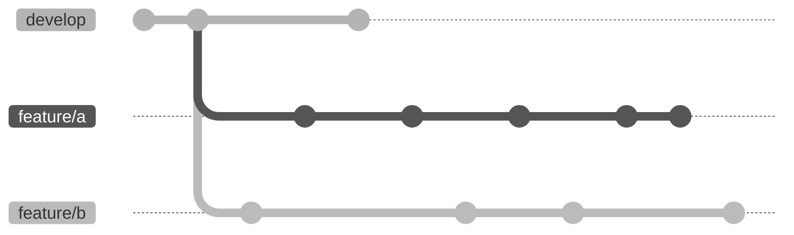
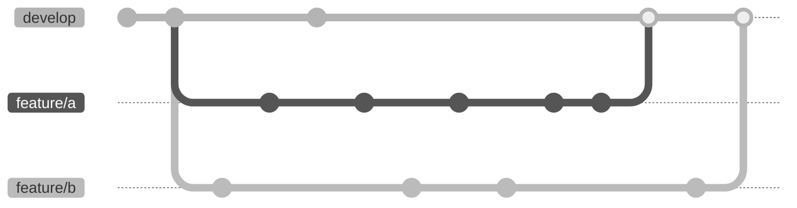
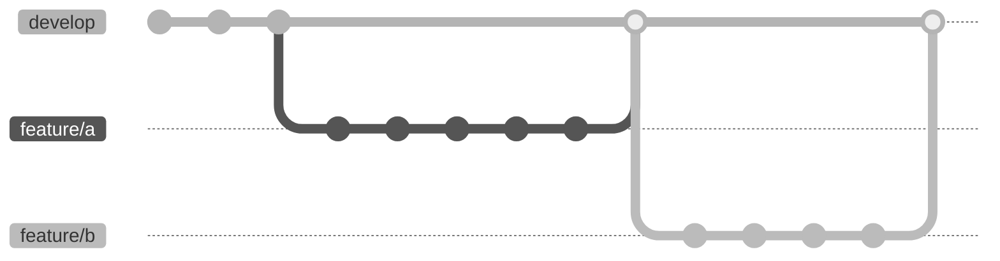

# SDT Instructions for Developers <!-- omit in toc -->
## Table of Contents <!-- omit in toc -->
- [Git](#git)
  - [Commit frequency vs size](#commit-frequency-vs-size)
  - [Feature branches](#feature-branches)
  - [Binary files](#binary-files)
- [Formatting](#formatting)
- [Versioning](#versioning)
- [Releasing](#releasing)

## Git
We are using
[`git-flow`](https://nvie.com/posts/a-successful-git-branching-model/)
branching model. Consider using automated tools to manage your branches

### Commit frequency vs size
When possible, prefer a big number of small (self-contained) commits over a
small number of big commits. This usually helps the other contributors in
understanding what you are have done.

### Feature branches
Merged feature branches should not overlap.
To avoid this, consider rebasing your feature branch with respect to `develop`
before merging, or use `git flow feature rebase` if you are using `git-flow`
automated tools.

This is ok, because branches have not been merged yet


This is not ok, because branches overlap


This is ok, because branches have been correctly rebased


### Binary files
As a general rule, avoid versioning binary files directly using git.

## Formatting
We are using `clang-format` for code style consistency. We are using `Google` style.
To format a file, run
```bash
clang-format -i <filepath>
```
It should automatically load the style file [`.clang-format`](.clang-format).

## Versioning
The Sound Design Toolkit is a collection of three pieces of software: the core library, the Pure Data library and the Max package. Each of these pieces of software has its own version number. Since the Pd library and the Max package depend on the core library, their version numbers should be complemented by the core library version number, where possible.

Important releases may be labelled with a version name, which would be a two-word phrase made of an adjective and a substantive, with the same initials, in alphabetically increasing order.

Although this has not always been the case throughout the SDT codebase history, we are now adopting [semantic versioning 2.0.0](https://semver.org).

- The core library version number is stored in the C header file [`SDTCommon.h`](src/SDT/SDTCommon.h), as the macro `SDT_ver`
- The Pd library version number is stored in the plain-text file [`Pd/VERSION`](Pd/VERSION)
- The Max package version number is stored in the JSON file [`MaxPackage/package-info.json`](MaxPackage/package-info.json), as the `version` field

Current versions can be logged using Make.
```bash
make core_version
```
```bash
make pd_version
```
```bash
make max_version
```

## Releasing
Releases are automated through GitHub actions. They are triggered when a tag is pushed to the repository that starts with `"v"`. Releases are always created as *drafts*: to be finalized, the draft option must be manually switched off.

GitHub actions will also automatically build the SDT software and upload it to the release, along with the reference manual. They will also update the online documentation at https://skat-vg.github.io/SDT.

Release tags should contain the version number of all three pieces of the SDT software. The default release tag can be logged using Make.
```bash
make full_version
```
